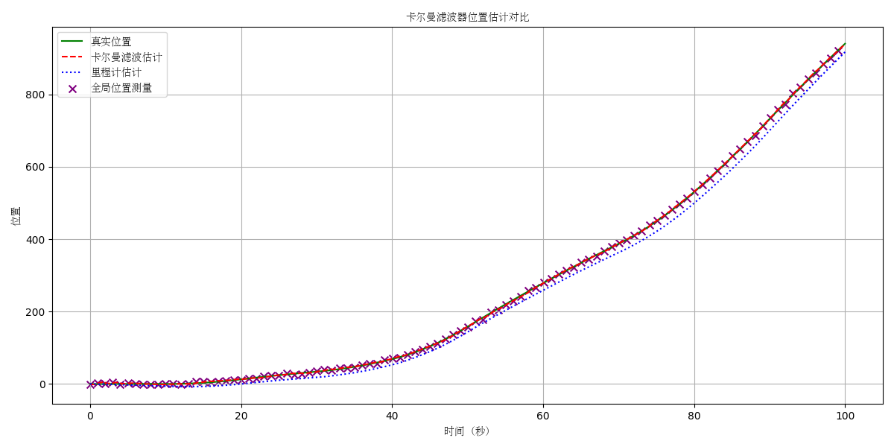

# 20250327 授课内容

本次授课主要是三个方面的内容：
- 无人机的两种定位模式
- 如何搭建自己的自定义环境
- 使用不同的无人机模型

## 一、无人机的两种不同定位模式

部分同学的Project的场景在室外，可以采用GPS定位；部分同学的Project的场景在室内，需要自己另行部署其他定位算法。在这里向大家简要介绍XTDrone中的两种定位模式。

### 引子：什么是卡尔曼滤波（Kalman Filter）

一个例子: 在一维直线上，一个车辆（质点）能够通过自身的IMU获取到自身有噪声的加速度信息，通过积分得到自身的里程计信息。

但是由于噪声的存在，积分过程不可避免会漂移和发散。

此时有一个较低频率的全局位置帮助抑制漂移，使用卡尔曼滤波将两者结合，得到高频稳定的位置估计。

拓展卡尔曼滤波（Extended Kalman filter, EKF），是针对非线性系统的卡尔曼滤波变种。传统卡尔曼滤波器只适用于线性系统，而EKF通过对非线性函数进行一阶泰勒展开（线性化），使其能够应用于非线性系统。在无人机系统中，由于状态转移方程和观测方程通常是非线性的，因此大多采用EKF进行状态估计。
PX4飞控中集成了EKF2模块，可以融合多种传感器数据（GPS、视觉定位、气压计等）进行状态估计，提供稳定的位姿输出。

### 无人机的两种定位方法

XTDrone平台中提供了两种定位方式，如何切换参见[PX4飞控EKF配置](https://www.yuque.com/xtdrone/manual_cn/ekf_settings)

#### 定位方式一：GPS定位 + 飞控IMU
这是室外飞行常用的定位方式，主要特点：
- **优点**：全球覆盖，无需额外基础设施，开箱即用
- **缺点**：精度有限（米级），室内信号弱或无信号，易受干扰
- **适用场景**：开阔的室外环境，对精度要求不高的应用

修改参数：

    # GPS used
    param set EKF2_AID_MASK 1
    # Vision used and GPS denied
    # param set EKF2_AID_MASK 24

    # Barometer used for hight measurement
    param set EKF2_HGT_MODE 0
    # Barometer denied and vision used for hight measurement
    # param set EKF2_HGT_MODE 3

#### 定位方式二：机载计算机进行定位解算 + 飞控IMU

这是室内飞行或需要高精度定位时的常用方式，主要特点：
- **优点**：高精度（厘米级甚至毫米级），不依赖GPS信号
- **缺点**：需要额外的传感器和计算资源，可能需要预先建图或部署定位基础设施
- **适用场景**：室内环境，GPS信号弱或不可用的场所，需要高精度定位的任务
请注意，采用该种方式时，要向`mavros/vision_pose/pose`话题发送定位消息，将信息传递给飞控实现状态估计

修改参数：

    # GPS used
    #param set EKF2_AID_MASK 1
    # Vision used and GPS denied
    param set EKF2_AID_MASK 24

    # Barometer used for hight measurement
    #param set EKF2_HGT_MODE 0
    # Barometer denied and vision used for hight measurement
    param set EKF2_HGT_MODE 3

常见的室内定位方案包括：
- 视觉SLAM（如ORB-SLAM2、VINS-Fusion等）
- 激光SLAM（如Cartographer、LIO-SAM等）
- 基于特殊标记的定位（如AprilTag、ArUco码等）
- 超宽带（UWB）定位系统
- 运动捕捉系统（如OptiTrack、Vicon等）

XTDrone Example：[三维激光SLAM](https://www.yuque.com/xtdrone/manual_cn/3d_laserslam)

## 二、如何搭建自己需要的自定义环境

部分同学的Project需要自行搭建，这里给大家一个在gazebo中搭建世界和添加元素的例子：

### 创建世界文件和补充模型

#### 采用Gazebo手动设置
- Building Editor：创建建筑物，可以定义房间、门窗等
    - 启动方式：在Gazebo界面顶部工具栏选择Edit->Building Editor
    - 创建流程：设计平面图→添加门窗→调整高度→保存
- Adding Model：添加预设或自定义模型
    - 方法1：从左侧Insert面板拖放模型到场景中
    - 方法2：使用Model Editor创建自定义模型
    - 方法3：直接编辑SDF文件添加模型

#### 为什么不问问万能的AI呢
An Example: 
 - **Prompt**: 在`src/coe_course/xtd_tutorial/resources/worlds`下生成一个世界文件，其中包含一个简单的迷宫，并用模型标注起点和终点
 - **Output**: `src/coe_course/xtd_tutorial/resources/worlds/maze_world.world`
 - **Test**: `gazebo ~/ws_coe/src/coe_course/xtd_tutorial/resources/worlds/maze_world.world`

### 运动的行人
你可能需要一个运动的行人，参见[Actor行人插件配置](https://www.yuque.com/xtdrone/manual_cn/actor_plugin)。

### 风插件
你可能需要模拟环境中的阵风，或者随意操控风向和大小，参见[开启"风"插件](https://www.yuque.com/xtdrone/manual_cn/wind_plugin)。

## 三、使用不同的无人机模型

基本上所有同学的Project都需要额外增设传感器，这里通过增设双目相机为例，给大家简要说明模型中增添传感器的方法。

但是，常用的传感器已经在XTDrone中得到了集成，最直接的方式是直接使用对应的模型就好了。例如，带有双目相机的iris无人机直接使用`iris_stereo_camera.sdf`即可。

你可以在`~/PX4_Firmware/Tools/sitl_gazebo/models`下面找到部分可用的无人机模型。

### 在launch文件中使用
以`indoor1.launch`为例，目前文件中Line35-Line36

    <arg name="vehicle" value="iris"/>
    <arg name="sdf" value="iris_stereo_camera"/>

表明当前的机型为`iris`，而模型采用了`iris_stereo_camera`。机型决定的是控制通道、混控文件等方案，而模型文件决定了具体搭载的模型是什么。

例如将模型换为搭载深度相机的`iris_depth_camera`，或者三维激光雷达`iris_3d_lidar`。

或者采用`typhoon_h480`机型，文件就要改为

    <arg name="vehicle" value="typhoon_h480"/>
    <arg name="sdf" value="typhoon_h480"/>

`typhoon_h480`的特征是包含了云台，这对于一些需要调整相机视角的要求特别有用。

### 获取传感器的信息

当修改了对应的传感器模型后，ROS Topic列表里面一般会出现对应的话题，自行根据话题名称进行判断即可。例如

- iris_stereo_camera 

    /iris_0/stereo_camera/left/camera_info
    /iris_0/stereo_camera/left/image_raw
    /iris_0/stereo_camera/left/image_raw/compressed
    /iris_0/stereo_camera/left/image_raw/compressed/parameter_descriptions
    /iris_0/stereo_camera/left/image_raw/compressed/parameter_updates
    /iris_0/stereo_camera/left/image_raw/compressedDepth
    /iris_0/stereo_camera/left/image_raw/compressedDepth/parameter_descriptions
    /iris_0/stereo_camera/left/image_raw/compressedDepth/parameter_updates
    /iris_0/stereo_camera/left/image_raw/theora
    /iris_0/stereo_camera/left/image_raw/theora/parameter_descriptions
    /iris_0/stereo_camera/left/image_raw/theora/parameter_updates
    /iris_0/stereo_camera/left/parameter_descriptions
    /iris_0/stereo_camera/left/parameter_updates
    ...

- iris_depth_camera

    /camera/depth/camera_info
    /camera/depth/image_raw
    /camera/depth/points
    /camera/rgb/camera_info
    /camera/rgb/image_raw
    /camera/rgb/image_raw/compressed
    /camera/rgb/image_raw/compressed/parameter_descriptions
    /camera/rgb/image_raw/compressed/parameter_updates
    /camera/rgb/image_raw/compressedDepth
    /camera/rgb/image_raw/compressedDepth/parameter_descriptions
    /camera/rgb/image_raw/compressedDepth/parameter_updates
    /camera/rgb/image_raw/theora
    /camera/rgb/image_raw/theora/parameter_descriptions
    /camera/rgb/image_raw/theora/parameter_updates

### *传感器的本质——插件（Plugin）

插件赋予了Gazebo很强的灵活性和可拓展性，这里以`iris_stereo_camera.sdf`文件来说明。

    <plugin name='mavlink_interface' filename='libgazebo_mavlink_interface.so'>
    <!-- codes -->

    <plugin name='magnetometer_plugin' filename='libgazebo_magnetometer_plugin.so'>
    <!-- codes -->

    <plugin name='rotors_gazebo_imu_plugin' filename='libgazebo_imu_plugin.so'>
    <!-- codes -->

你可以尝试编写自己的插件，完成自己想要的功能。